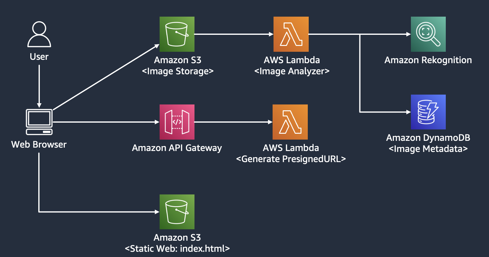

# Welcome to Serverless Image Analyzer on AWS!
This repository demonstrate how to develop a serverless web application for uploading (JPEG) image and extract the image attributes/metadata using Amazon Rekognition. The result will be stored on Amazon DynamoDB.

## High Level Architecture


----

# Install Instruction
This project is set up like a standard Python project.  The initialization
process also creates a virtualenv within this project, stored under the `.venv`
directory.  To create the virtualenv it assumes that there is a `python3`
(or `python` for Windows) executable in your path with access to the `venv`
package. If for any reason the automatic creation of the virtualenv fails,
you can create the virtualenv manually.

To manually create a virtualenv on MacOS and Linux:

```
$ python3 -m venv .venv
```

After the init process completes and the virtualenv is created, you can use the following
step to activate your virtualenv.

```
$ source .venv/bin/activate
```

If you are a Windows platform, you would activate the virtualenv like this:

```
% .venv\Scripts\activate.bat
```

Once the virtualenv is activated, you can install the required dependencies.

```
$ pip install -r requirements.txt
```

At this point you can now synthesize the CloudFormation template for this code.

```
$ cdk synth
```

To add additional dependencies, for example other CDK libraries, just add
them to your `setup.py` file and rerun the `pip install -r requirements.txt`
command.

----

## Options for creating CI/CD pipeline 
You can provision this application infrastructure by running "cdk deploy" command.
But you could also create CI/CD pipeline using the following options.

### 1. CodePipeline 
you could also create a CI/CD pipeline by replace the following code in app.py

```python
ServerlessImageAnalyzerStack(app, "ServerlessImageAnalyzerStack")
```

with

```python
ServerlessImageAnalyzerPipelineStack(app, "ServerlessImageAnalyzerPipelineStack")
```

Run "cdk deploy" to create a CI/CD pipeline to deploy this application into your AWS account.

### 2. CodeCatalyst
You can fork this repository, create a CodeCatalyst project and link the forked repository to your project.
The "Workflow-Deploy.yaml" under ".codecatalyst" folder is an example of the workflow (CI/CD pipeline) that you could use.

You can create your own workflow on CodeCatalyst console or modify this file to match your configuration.
```yaml
Configuration:
      Region: <<your preferred region>>
    Environment:
      Connections:
        - Role: <<your created CodeCatalyst Role>>
          Name: <<your AWS account ID>>
```

----

## Useful commands

 * `cdk ls`          list all stacks in the app
 * `cdk synth`       emits the synthesized CloudFormation template
 * `cdk deploy`      deploy this stack to your default AWS account/region
 * `cdk diff`        compare deployed stack with current state
 * `cdk docs`        open CDK documentation

Enjoy!
